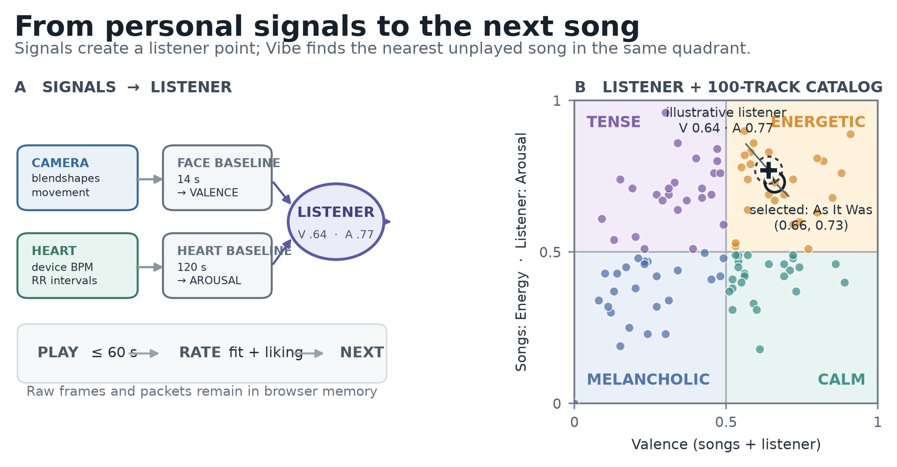
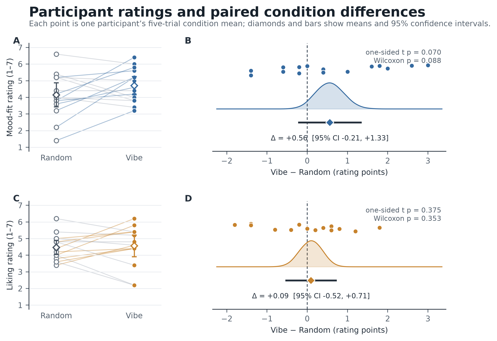

# Vibe Shuffle study documentation

This document describes the research concept, sensing pipeline, adaptation
logic, study protocol, results, and known limitations of the repository
snapshot used for the 2026 final project report. It is written as a practical
companion to the [full report](../public/paper.pdf), not as a replacement for
it.

## Scope and claim boundary

Vibe Shuffle asks a narrow HCI question:

> Does a transparent, affect-adaptive song-selection policy produce higher
> participant-rated mood fit than random selection from the same fixed catalog?

The prototype does **not** validate an objective emotion detector. Camera and
heart-rate data are treated as imperfect proxies that control an interaction.
The human outcome is the participant's rating of whether the selected song fit
their current mood.

## Concept

The system places both the listener and every song in a two-dimensional
Valence–Arousal space:

- **Energetic:** positive valence, high arousal;
- **Calm:** positive valence, low arousal;
- **Tense:** negative valence, high arousal; and
- **Melancholic:** negative valence, low arousal.

Adaptation happens only between songs. While a song is playing, the browser
summarizes facial cues, movement, and optional heart-rate information. At the
next selection point, Vibe mode chooses the nearest unplayed song from the
matching quadrant. Random mode chooses an unplayed song using a session-seeded
pseudorandom ranking. The presented sequence is exported, but the seed itself
is not, so the ranking cannot be regenerated later from the export alone.



## Evidence levels

The implementation keeps observation, inference, action, and evaluation
separate:

| Level | Evidence | Meaning in Vibe Shuffle |
| --- | --- | --- |
| Observation | Facial blendshapes and visible movement | Camera-derived behavior, not happiness or sadness itself |
| Observation | Device-reported BPM and RR intervals | Processed heart timing, not a raw ECG waveform |
| Derived feature | Facial scores, movement, HR change, RMSSD change | Baseline-relative summaries |
| Inference | Valence–Arousal coordinate | An operational interaction estimate |
| Action | Next-track selection | Nearest unplayed catalog item in the matching region |
| Outcome | Mood-fit and liking ratings | Participant judgment of the recommendation |

This separation matters because none of the sensor channels has a one-to-one
relationship with a psychological state.

## Signal pipeline

### Facial cues and movement

The browser runs MediaPipe Face Landmarker locally and targets one face. It
samples approximately every 120 ms and combines selected smile, cheek, brow,
eye, jaw, frown, and mouth blendshapes into three active scores: happiness,
sadness, and tension. Relaxed is the fallback when no score is sufficiently
strong.

At the level needed to understand the design, the Valence rule is:

```text
valence ≈ 0.5 + 1.05 × (happiness − 0.55 × sadness − 0.45 × tension)
```

The result is capped near the ends of the scale. These constants were selected
empirically during prototyping; they were not learned from labelled emotional
data and must not be interpreted as psychological coefficients.

The face channel uses a 14-second personal calibration, baseline subtraction,
frame-to-frame smoothing, a margin between competing expressions, and normally
three consistent samples before changing a discrete label. A slow facial
baseline continues adapting during the session.

The camera also estimates nose-tip motion, vertical reversals resembling
nodding, and broader changes in a downscaled frame. Movement is summarized over
roughly 3.2 seconds. It raises Arousal and contributes positive evidence in the
current exploratory mapping. This assumption is explicitly unvalidated and can
double-count behavior that also changes heart rate.

### Heart rate and beat intervals

The optional wearable connects through the standard Bluetooth Heart Rate
Service. The application receives BPM and, when available, RR intervals. It has
no access to the raw cardiac waveform or the device's peak-detection process.
The exact wearable model, sensing modality, placement, and vendor processing
were not preserved in the supplied study archive and must be documented from
the team's records.

RR preprocessing is intentionally simple:

- accept finite intervals between 300 and 2,000 ms;
- reject a value when it differs by more than 30% from the previous accepted
  interval;
- do not interpolate rejected intervals;
- require at least 20 accepted intervals before HRV is marked usable; and
- export accepted, rejected, and total counts plus the artifact rate.

The main variability feature is RMSSD, a short-term summary of neighboring beat
interval differences. A 120-second resting period provides personal median HR
and RMSSD references. The live path uses an eight-second rolling window and can
temporarily rely on heart rate before sufficient RR data are available.

The report-level Arousal rule is:

```text
arousal ≈ 0.5 + 0.18 × (0.75 × relative HR rise + 0.35 × relative RMSSD fall)
```

Small changes are ignored, large changes are capped, and RMSSD receives less
weight because it is unstable in short windows. Respiration was not recorded.
Consequently, RMSSD is secondary baseline-relative evidence and is not treated
as a direct measure of respiratory sinus arrhythmia, vagal activity, stress, or
a particular emotion.

### Fusion and fallbacks

The channels have a fixed division of labor:

- a detected face supplies Valence;
- usable cardiac data supplies the Arousal base;
- visible movement can add upward Arousal;
- without cardiac data, camera movement supplies upward-only Arousal;
- without a face, Valence remains at the neutral midpoint; and
- without either usable channel, the coordinate returns to the center.

During playback, valid fused positions enter an event-driven trial buffer. The
position used for selection is their arithmetic mean. It is not a regularly
sampled or time-weighted 60-second estimate.

## Catalog and adaptation

The fixed catalog contains 100 unique Spotify tracks, with 25 assigned to each
Valence–Energy quadrant. Historical Spotify features originate from a public
Spotify Tracks dataset and are stored in `src/studyCatalog.js`; the prototype
does not request live audio features from Spotify.

Musical Energy is used as the catalog-side counterpart of listener Arousal.
This is a practical alignment assumption, not evidence that the constructs are
identical. The catalog is balanced by quadrant count, but not by artist, genre,
language, familiarity, or popularity.

Both conditions exclude the current track and every previously heard track.
Vibe mode first filters to the inferred quadrant and then minimizes straight-
line distance in Valence–Arousal space. Random mode assigns deterministic
pseudorandom scores to remaining tracks. The first track can be selected before
the 14-second facial calibration is complete; later choices reflect the recent
state observed during the preceding song.

## Study protocol

The application implements a participant-blinded, within-participant crossover:

- one five-track Random block and one five-track Vibe block;
- Protocol 1: Random then Vibe;
- Protocol 2: Vibe then Random;
- ten trials per participant;
- up to 60 seconds of listening per track;
- early rating permitted and recorded; and
- confirmed Spotify playback before timing and signal collection advance.

After each song, the participant rates liking and mood fit on seven-point scales
and reports a current mood category. Mood fit is the primary outcome and liking
is secondary. Participant view hides condition labels and diagnostics, but this
is participant blinding rather than double blinding.

## Results

The supplied analysis contains 15 complete participant/session rows. Each row
summarizes five Vibe and five Random ratings, so the participant—not an
individual song rating—is the independent unit.

| Outcome | Vibe M (SD) | Random M (SD) | Paired difference [95% CI] | One-sided paired t-test | Cohen's dz |
| --- | ---: | ---: | ---: | ---: | ---: |
| Mood fit | 4.71 (0.99) | 4.15 (1.30) | +0.56 [-0.21, 1.33] | t(14) = 1.56, p = .070 | 0.40 |
| Liking | 4.56 (1.18) | 4.47 (0.77) | +0.09 [-0.52, 0.71] | t(14) = 0.32, p = .375 | 0.08 |

For both outcomes, eight participants were higher under Vibe, one tied, and six
were lower. The mood-fit result is directionally promising but inconclusive:
its confidence interval includes both a small disadvantage and a practically
meaningful advantage. Liking was nearly unchanged, but the interval is too wide
to establish formal equivalence.

The supplied summary rounded tied ranks for the liking Wilcoxon result. Using
conventional average ranks gives `W+ = 58.5`, one-sided asymptotic `p = .353`,
instead of `W+ = 59`, `p = .341`. This correction does not change the
conclusion. Exact aggregate values are stored in
[`paper/analysis/statistics.json`](../paper/analysis/statistics.json).



## Data quality and availability

The result summary confirms complete 5/5 condition means but does not contain
raw trial rows. Therefore, within-session variance, early exposure, sensor
fallbacks, artifact rates, and quality flags cannot be audited from the supplied
analysis alone.

Three source filenames repeat a participant-style `P1` label. The result report
treats them as naming errors and assigns unique participant IDs, but recruitment
or session records should verify that they are distinct people before
submission.

Participant-labelled exports and source filenames are intentionally not
published in this repository. The available archive does not establish consent
for public release of individual-level data. The repository contains aggregate
statistics and de-identified figures; a fuller data release requires a
documented consent and anonymization decision by the project team.

## Privacy boundary

The application has no study backend or analytics endpoint. Camera frames,
facial landmarks, and Bluetooth notifications remain in browser memory. CSV
files are created as local downloads and contain derived values, timestamps,
protocol information, ratings, and pseudonymous participant numbers—no images,
video, landmark sets, or raw cardiac waveform.

The system still contacts GitHub Pages, MediaPipe asset hosts, and Spotify for
authentication and playback. Exports are pseudonymous rather than anonymous
and must be handled accordingly.

## Main threats to validity

- Facial mappings and physiological weights are hand-tuned heuristics, not
  validated psychological models.
- Lighting, pose, occlusion, morphology, culture, and deliberate expression can
  change facial outputs.
- Movement can affect the camera estimate, heart rate, and RR quality at once.
- Heart rate and RMSSD also depend on respiration, posture, fitness, medication,
  illness, sensor contact, and vendor preprocessing.
- The one-minute listening window is short for HRV, and respiration was not
  recorded.
- Conditions are blockwise with no implemented washout, so fatigue, learning,
  time, and carryover remain possible despite counterbalancing.
- The second block receives a smaller remaining song pool because heard tracks
  are excluded across the session.
- The fixed catalog controls exposure but does not balance artist, genre,
  language, familiarity, or popularity.
- Early rating creates unequal exposure, while self-reported mood is collected
  after listening and is not simultaneous ground truth for selection-time
  inference.
- The sample contains only 15 paired observations, so estimates are imprecise
  and cannot resolve participant heterogeneity.

## Known implementation issues in the evaluated snapshot

1. The automatic final CSV download in `src/App.jsx` references an undefined
   `latestRatings` value after the last trial. The manual **Save CSV** path uses
   updated data. This should be repaired and covered by an end-to-end ten-trial
   export test before another study.
2. The neutral coordinate `(0.5, 0.5)` can receive different labels along two
   code paths. The coordinate remains the same, but exported categorical labels
   can be inconsistent.

These issues are documented here; this documentation update does not claim to
fix them.

## Recommended next study

A stronger evaluation should preregister a meaningful paired effect, preserve
trial-level exports, start adaptation only after all required baselines are
complete, use a time-weighted fused trajectory, record respiration and sensor
context, balance catalog attributes, report protocol order, and validate the
facial and cardiac mappings separately before testing recommendation utility.
